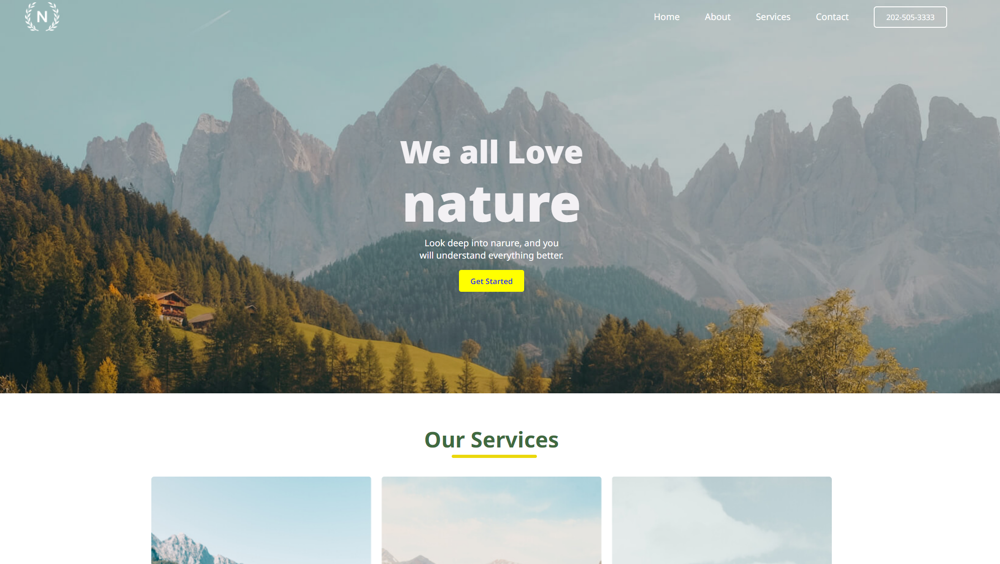

# 🌐 Nature website - HTML & CSS only

A simple HTML & CSS project built to practice front-end design
> 🖥 Desktop-only layout (not responsive).

## 🚀 Live Demo
🔗 [View on GitHub Pages](https://basupokharel.github.io/CSS_Practice-nature-website/)

## 🧰 Built With
- HTML5  
- CSS3  

## 💡 Features
- Clean layout  
- Custom colors and typography  
- Basic hover effects  

## 📸 Preview

## 🧑‍💻 Author
**Basudev Pokharel**  
[Basu-github](https://github.com/Basudev-Pokharel) 
[Basu-LinkedIN](https://www.linkedin.com/in/basudev-pokharel/)
